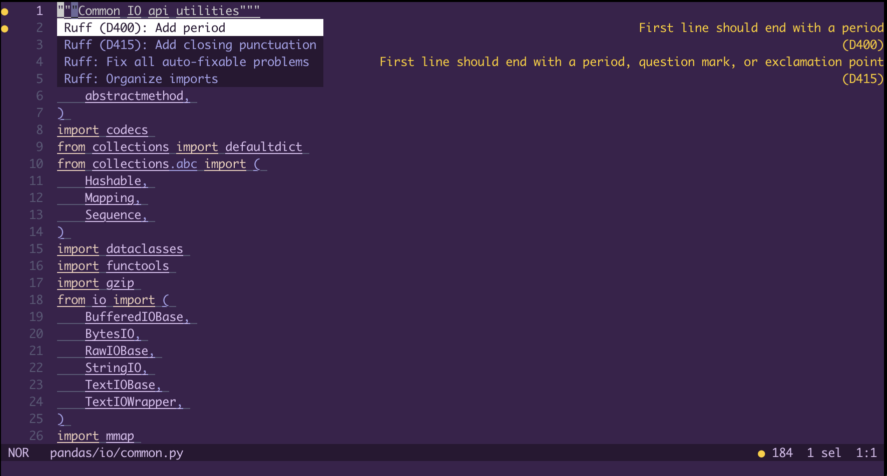

## Helix Setup Guide for `ruff server`

First, open the language configuration file for Helix. On Linux and macOS, this will be at `~/.config/helix/languages.toml`,
and on Windows this will be at `%AppData%\helix\languages.toml`.

Add the language server by adding:

```toml
[language-server.ruff]
command = "ruff"
args = ["server", "--preview"]
```

Then, you'll register the language server as the one to use with Python.
If you don't already have a language server registered to use with Python, add this to `languages.toml`:

```toml
[[language]]
name = "python"
language-servers = ["ruff"]
```

Otherwise, if you already have `language-servers` defined, you can simply add `"ruff"` to the list. For example,
if you already have `pylsp` as a language server, you can modify the language entry as follows:

```toml
[[language]]
name = "python"
language-servers = ["ruff", "pylsp"]
```

> \[!NOTE\]
> Multiple language servers for a single language are only supported in Helix version [`23.10`](https://github.com/helix-editor/helix/blob/master/CHANGELOG.md#2310-2023-10-24) and later.

Once you've set up the server, you should see diagnostics in your Python files. Code actions and other LSP features should also be available.


*This screenshot is using `select=["ALL]"` for demonstration purposes.*

If you want to, as an example, turn on auto-formatting, add `auto-format = true`:

```toml
[[language]]
name = "python"
language-servers = ["ruff", "pylsp"]
auto-format = true
```

See the [Helix documentation](https://docs.helix-editor.com/languages.html) for more settings you can use here.

You can pass settings into `ruff server` using `[language-server.ruff.config.settings]`. For example:

```toml
[language-server.ruff.config.settings]
lineLength = 80
[language-server.ruff.config.settings.lint]
select = ["E4", "E7"]
preview = false
[language-server.ruff.config.settings.format]
preview = true
```

By default, Ruff does not log anything to Helix. To enable logging, set the `RUFF_TRACE` environment variable
to either `messages` or `verbose`. This will set the trace level for this server.

```toml
[language-server.ruff]
command = "ruff"
args = ["server", "--preview"]
environment = { "RUFF_TRACE" = "messages" }
```

> \[!NOTE\]
> `RUFF_TRACE=verbose` does not enable Helix's verbose mode by itself. You'll need to run Helix with `-v` for verbose logging.

To change the log level for Ruff (which is `info` by default), use the `logLevel` setting:

```toml
[language-server.ruff]
command = "ruff"
args = ["server", "--preview"]
environment = { "RUFF_TRACE" = "messages" }

[language-server.ruff.config.settings]
logLevel = "debug"
```

You can also divert Ruff's logs to a separate file with the `logFile` setting:

```toml
[language-server.ruff]
command = "ruff"
args = ["server", "--preview"]
environment = { "RUFF_TRACE" = "messages" }

[language-server.ruff.config.settings]
logLevel = "debug"
logFile = "your/log/file/path/log.txt"
```
